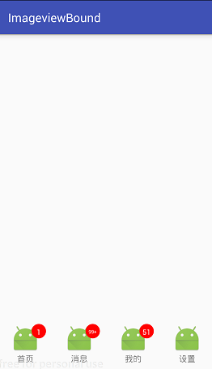

# ImageviewBound
带有角标的iamgeview，类似于qq、微信未读消息提示效果

### 1.引入方式
#### maven：
    <dependency>
      <groupId>com.hlq</groupId>
      <artifactId>imageviewBound</artifactId>
      <version>1.0.0</version>
      <type>pom</type>
    </dependency>
#### gradle:
      compile 'com.hlq:imageviewBound:1.0.0'
### 2.使用方式
     在xml中：
      <hlq.ImageViewBound
          android:id="@+id/wode"
          android:layout_width="wrap_content"
          android:layout_height="wrap_content"
          android:src="@mipmap/ic_launcher" />
      在java代码中：
      imageViewBound.setMessageNum(1);每次设置都实时有效
      当设置的数量>=100时，则会显示99+，字体大小根据设置的数字自动适配。
### 3.效果图
   
    
      
